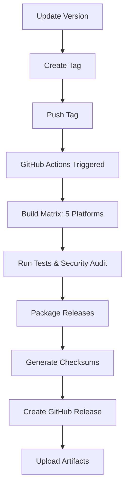

# Release Guide for BTC Split Key

## 🚀 Automated Release Process

### Prerequisites
- Push access to the repository
- All tests passing on main branch
- Updated version number in `Cargo.toml`

### Release Steps

1. **Update Version**
   ```bash
   # Update version in Cargo.toml
   vim Cargo.toml  # Change version = "x.y.z"
   
   # Update Cargo.lock
   cargo check
   
   # Commit version bump
   git add Cargo.toml Cargo.lock
   git commit -m "Bump version to x.y.z"
   git push origin main
   ```

2. **Create and Push Tag**
   ```bash
   # Create annotated tag
   git tag -a v1.0.0 -m "Release version 1.0.0"
   
   # Push tag (triggers GitHub Actions)
   git push origin v1.0.0
   ```

3. **GitHub Actions Handles the Rest**
   - Builds for all platforms (Linux x64/ARM64/musl, Windows x64/x86)
   - Runs security audit
   - Generates checksums
   - Creates GitHub Release with binaries
   - Updates release notes

## 🛠️ Manual Release Process

If you prefer manual releases or need to build locally:

### Quick Release (Linux + Windows x64)
```bash
./release.sh
```

### Full Cross-Platform Build
```bash
./cross-build.sh
```

### Using Makefile
```bash
# Setup cross-compilation environment
make setup-cross

# Build all platforms
make cross-build

# Quick release
make quick-release
```

## 📦 Release Artifacts

Each release includes:

| Platform | File | Description |
|----------|------|-------------|
| Linux x64 | `btc-split-key-vX.X.X-linux-x64.tar.gz` | Standard Linux binary |
| Linux x64 musl | `btc-split-key-vX.X.X-linux-x64-musl.tar.gz` | Static binary for older systems |
| Linux ARM64 | `btc-split-key-vX.X.X-linux-arm64.tar.gz` | ARM64/aarch64 binary |
| Windows x64 | `btc-split-key-vX.X.X-windows-x64.zip` | Windows 64-bit binary |
| Windows x86 | `btc-split-key-vX.X.X-windows-x86.zip` | Windows 32-bit binary |
| Checksums | `SHA256SUMS.txt` | Verification checksums |

## 🔒 Security Verification

### For Release Creator
```bash
# Verify local builds work
./target/release/btc-split-key generate
./target/release/btc-split-key --help

# Test cross-compiled binaries
./releases/*/btc-split-key* --version  # Linux
wine ./releases/*/btc-split-key*.exe --version  # Windows (if wine installed)
```

### For Users
```bash
# Download release and checksums
wget https://github.com/user/btc-split-key/releases/download/v1.0.0/btc-split-key-v1.0.0-linux-x64.tar.gz
wget https://github.com/user/btc-split-key/releases/download/v1.0.0/SHA256SUMS.txt

# Verify checksums
sha256sum -c SHA256SUMS.txt

# Extract and test
tar -xzf btc-split-key-*.tar.gz
cd btc-split-key-*/
./btc-split-key --version
```

## 📋 Pre-Release Checklist

- [ ] All tests pass (`cargo test`)
- [ ] Code is formatted (`cargo fmt`)
- [ ] Clippy passes (`cargo clippy -- -D warnings`)
- [ ] Security audit passes (`cargo audit`)
- [ ] Documentation is updated
- [ ] Version bumped in `Cargo.toml`
- [ ] Release notes prepared
- [ ] Cross-compilation tested
- [ ] Binaries tested on target platforms

## 🔄 Release Workflow



## 🐛 Troubleshooting

### GitHub Actions Fails
- Check workflow logs in GitHub Actions tab
- Ensure all required secrets are set
- Verify cross-compilation tools are properly installed

### Local Build Fails
```bash
# Update Rust toolchain
rustup update

# Clean and rebuild
cargo clean
cargo build --release

# Check cross-compilation setup
make setup-cross
```

### Binary Doesn't Work
- Verify target platform compatibility
- Check library dependencies with `ldd` (Linux) or `dumpbin` (Windows)
- Test on clean system without dev tools

## 📝 Release Notes Template

```markdown
# BTC Split Key vX.X.X

## 🔒 Critical Security Notice
⚠️  **Only use on air-gapped systems for production Bitcoin keys!**

## ✨ New Features
- Feature 1
- Feature 2

## 🐛 Bug Fixes  
- Fix 1
- Fix 2

## 🔧 Changes
- Change 1
- Change 2

## 📦 Downloads
[Standard download table with checksums]

## 🔐 Verification
Always verify checksums before use!
```